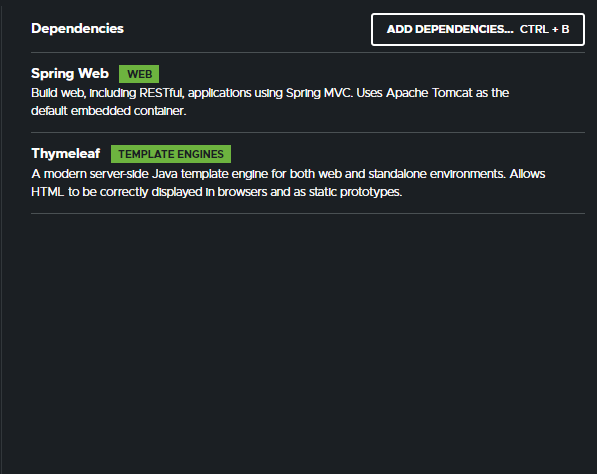
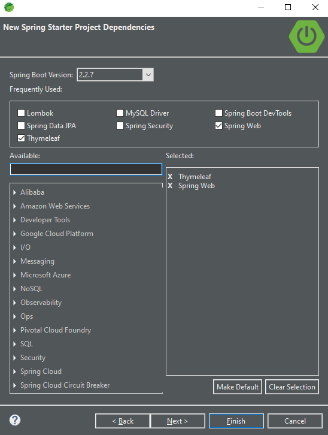

# Dependencias do Projeto
As dependencias utilizadas no nosso projeto serão:
* Spring Web
* Spring Security
* Spring Data JPA
* Spring Boot DevTools
* MySQL Driver
* Thymeleaf
* Lombok
## Um pouco sobre as dependencias escolhidas

### Spring Web
Esta dependencia nos proporciona tudo relacionado ao framework spring MVC e a arquitetura REST, além de um container do tomcat (_por padrão, nos dando ainda a escolha de troca_) todo configurado.

### Spring security
Nos proporciona um ambiente totalmente customizavel para segurança da nossa aplicação, gerenciador de acessos, autenticações por tokens e gerenciamento de autoridades.

### Spring Data JPA
Nos oferece um mapeamento de objeto -> dados e um ORM em tempo de compilação fantastico, facilitando absurdamente nossa vida quando se trata de persistencia de dados.

### Spring boot DevTools
O devtools a partir do momento em que rodamos nosso projeto, ele fica observando por alterações no codigo e assim que o alteramos reinicia automaticamente nossa aplicação.

### MySQL driver
O driver de conexão com nosso banco de dados, caso opte pelo PostgreSQL, apenas mude essa dependencia, demonstraremos a conexão com ambos.

### Thymeleaf
Template engine para ssr, nos oferece uma vasta gama de tags para deixar nosso HTML top

### Lombok
Nos proporciona annotations para deixar nosso codigo muito mais enxuto e menos massante

### Dependencias no site

    

### Dependencias na IDE

    

[Proximo Tópico](../2-Iniciando-com-spring/estrutura-inicial.md)