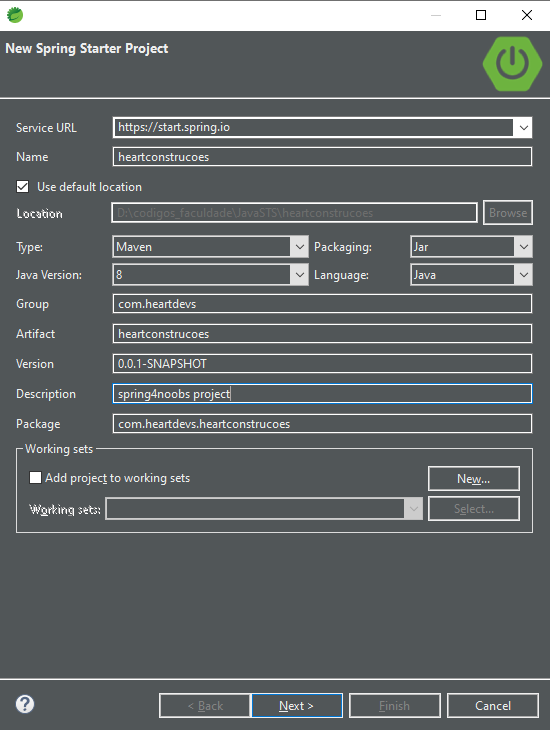

# Spring Initializr

O [spring initializr](https://start.spring.io) é uma ferramenta muito poderosa, utilizada para gerar a estrutura inicial do nosso projeto, podemos fazer uso dessa inicialização pelo site ou pela IDE proposta. Darei agora uma explicação das configurações e ao final desse capitulo disponibilizo um print com a configuração feita.

 * Automatizador de Compilação
 * Linguagem
 * Versão do spring boot
 * Metadatas do projeto
 * Versão do java
 * Dependencias
 * Packing

### Automatizador de Compilação
O maven e o gradle são responsaveis por gerenciar o projeto, eles fazem a gerencia do ciclo de vida do projeto e baixam as bibliotecas e os plug-ins de um [repositorio central](https://mvnrepository.com/), que ainda iremos fazer uso neste curso.
##### Ok, mas qual escolher? 
O gradle possui ferramentas poderosas para grandes projetos, mas para projetos menores que geralmente não necessitam destas ferramentas é mais indicado o uso do maven, que é a ferramenta que escolhemos para este curso.

### Linguagem
O spring oferece suporte a três linguagens, Java, Kotlin e Groovy, para este curso iremos fazer uso da linguagem Java.

### Versão do Spring boot
Iremos fazer uso da versão mais estável do spring _2.2.7_

### Metadatas do projeto
Nesta parte poderemos indicar os metadatas do projeto
* Group: Aqui indicamos o site, github, algo unico que nos identifique, no meu caso irei fazer uso do group _com.heartdevs_
* Artifact e Name: Aqui indicamos o nome que identificara o nosso projeto, no nosso caso _heartconstrucoes_
* Description: Uma simples descrição do nosso projeto
* Package name: O identificador final do nome do nosso package, geralmente group+artifact, resultando em _com.heartdevs.heartconstrucoes_

### Versão do java
Aqui fica por preferencia, no caso escolha a versão da JDK que você possui em sua maquina, no meu caso eu irei fazer uso da versão 8

### Packing
O packing é relacionado a o que você ira gerar após o termino do projeto para realizar o deploy, no nosso caso iremos deixar em Jar.

### Configuração pelo site

    

### Configuração pela IDE

    

### Dependencias
Abordaremos as dependencias no proximo topico, te espero lá 

[Proxima seção](./dependencias-do-projeto.md)