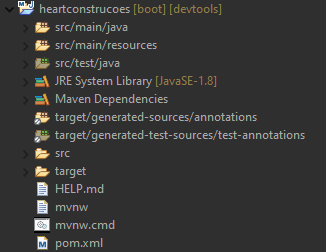

# Estrutura Inicial
Esta deverá ser a estrutura com que você irá se deparar após o import do projeto

    

### Nesta estrutura existem algumas pastas com as quais devemos prestar atenção, são essas:

* _src/main/java_
  * _com.heartdevs.heartconstrucoes_
    * _HeartconstrucoesApplication.java_
#### Aqui temos o main package com a classe principal da nossa aplicação, essa será a classe com que você irá iniciar a aplicação, isso devido a classe _SpringApplication_ chamando o metodo estatico _run_ que recebe a nossa classe principal e os args da main como argumento.
#### Temos também outra coisa muito importante aqui, que é a annotation _@SpringBootApplication_ essa belezinha é a responsavel por fazer a auto configuração da nossa aplicação que é uma das maiores features do spring boot.

* _src/main/resources_
  * _static_
  * _templates_
  * _application.properties_

#### Static: Aqui ficará todos nossos arquivos estaticos como CSS e JS.
#### Templates: Aqui ficará nosso HTML
#### application.properties: Um dos arquivos mais importanes da nossa aplicação, aqui ficará toda a configuração basica, como, conexão com banco de dados, configuração de tokens de acesso etc..

* _src/test/java_
#### Aqui ficará todo nosso codigo para testes

* _pom.xml_
#### Outro arquivo de extrema importancia para a nossa aplicação, nele está todo o metadata do projeto que configuramos no modulo sobre _spring initializr_ e as dependencias necessarias para rodar nosso projeto, ainda iremos mexer muito neste arquivo durante o curso.