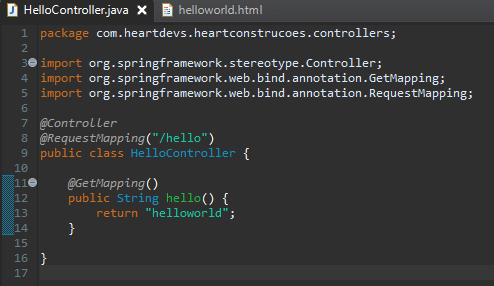

# Hello World!
#### Com tudo configurado e nos conformes, vamos para um pouco de teoria

#### Antes de partir para o codigo é bom um pouco de teoria sobre o que iremos apresentar neste modulo
* _Controllers_
* _Views_

### Controller
#### Um controller é responsavel por interceptar requisições e passar a carga destas requisições para os responsaveis e após tratar dessas requisições, no caso de um padrão MVC, fazer a chamada da view e no caso de um padrão REST apenas retornar os dados.

### View
#### As views são as paginas que carregam os nossos dados de uma forma visivel ao usuario final

### Packages

#### Para o spring conseguir identificar nossas classes devemos sempre iniciar nossos packages com o prefixo do package principal _com.heartdevs.heartconstrucoes_.

#### Para criar o nosso primeiro controller deveremos criar o package que ficará responsavel por agrupar nossas classes controllers _com.heartdevs.heartconstrucoes.controllers_, e dentro desta o nosso _HelloController_.

### HelloController
#### Para o spring saber que estamos criando um novo controller, não basta crialo dentro do package com nome de controller, deveremos fazer uso da annotation _@Controller_.
#### Está annotation faz com que nossa classe fique responsavel por interceptar requisições aos endpoints que iremos declarar dentro dela, inclusive podemos declarar um endpoint padrão ao nosso controller, declarando a annotation _@RequestMapping_ e passamos como parametro para ela o endpoint, no nosso caso _@RequestMapping("/hello")_.
#### Agora iremos declarar um metodo que ficará responsavel por interceptar as requisições do tipo _Get_ para o endpoint do nosso controller, será o _public String hello()_, e adicionaremos a annotation _@GetMapping_.
#### Iremos tambem criar a view responsavel por nos mostrar o nosso hello world, dentro do package _src/main/resources_ temos a pasta templates, que será onde iremos depositar todo nosso HTML, dentro dela crie o _helloworld.html_, dentro da tag _body_ crie um _h1_ com o nosso _Hello World!_
#### retornando ao nosso controller, mais expecificamente ao nosso metodo _hello_ de um return _helloworld_, por padrão o spring vai até a pasta templates e busca por um arquivo html com este nome, como acabamos de criar este está tudo pronto para rodar a nossa aplicação.

### Iniciando nossa aplicação
#### Após fazer todo o conteudo anteriormente falado, retorne ao package principal selecione a nossa main classe _HeartconstrucoesApplication.java_ de um click com o botão direito -> Run as -> Java Application, isso deve iniciar o nosso container do tomcat e se tudo ocorrer nos conformes e você não tiver nada rodando na porta _:8080_ sua aplicação já está rodando, basta acessar _localhost:8080/hello_ e ai está o seu _Hello World!_

#### Está devera ser a estrutura da classe _HelloController_ e de pastas com que você ficará após este modulo

    

    

> O HTML é simples, então creio que você já saiba fazer um hello world simples

[Proxima seção](./thymeleaf-e-model.md)